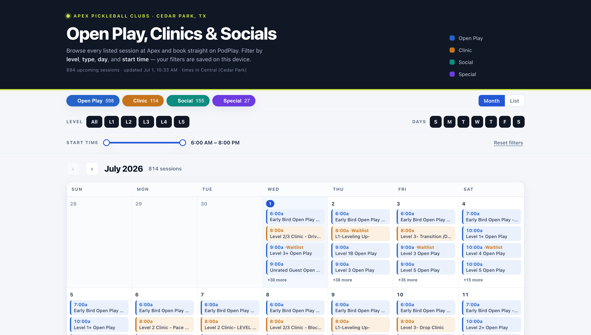

# Apex PodPlay Helper

A fast, filterable calendar for **[Apex Pickleball Clubs](https://apexpbclubs.podplay.app/community/events)** sessions — every open play, clinic, and social — with one-tap links to book on PodPlay.

**Live site:** https://chriswiles.github.io/apex-podplay-helper/



## What it does

- Shows every session **currently open for sign-up** in a **month grid** or **agenda list** (hides sessions past PodPlay's advance-registration window).
- Filters by **type** (open play / clinic / social / special), **skill level** (L1–L6 incl. `+` bands like L3+), **day of week**, and **start-time range**.
- **Search** by session **or player** name, an **"open spots only"** toggle, and a **Women's** filter — show all, **only** ladies' sessions (Ladies Night, Ladies Matchups, …), or **hide** them.
- **Friends** — star players in a session's "Who's going" list; sessions your friends signed up for get a **★ badge**, and you can filter to just those. Your friends list stays on your device.
- **"That's me"** — tell the app who you are (search your name, no login) and it flags what you're **registered** for ("✓ You're in") and your **waitlist** spots ("◷ Waitlist #N"), with a "My sessions" filter. A session card always states your status up front, so you're never unsure whether you actually waitlisted yourself. Opening a session live-refreshes its roster so your status is current — and if you tap **Book on PodPlay** and come back to this tab afterward, it automatically re-checks that same session so your status updates without reopening the card.
- **Double-booking warnings** — since you can only be on one court at a time, any session that overlaps a time slot you're already registered for is flagged ("⏱ Booked: …") on the calendar, in lists, and on the card, naming which session you're already in — or hide them outright with the **"⏱ Hide conflicts"** filter toggle.
- On mobile, tap **multiple days** on the calendar to see just those days' sessions.
- Each session opens a card with DUPR range, price (drop-in / member), spots left or waitlist — plus **how full it is** (% full with a fill meter and court count, 6 players per court) — and a **Book on PodPlay** deep link.
- **Installable** (Add to Home Screen) and works **offline** (PWA) — the shell and last-loaded data are cached.
- **Your filters are remembered** on your device (localStorage) between visits.
- Times shown in **Central (Cedar Park)**.

## How it works

The site is fully static — `index.html` fetches `./events.json` at runtime. There is **no server and no build step**.

`events.json` is produced by `scripts/fetch-events.mjs`, which reads Apex's public session catalog from the PodPlay API. PodPlay requires a Firebase auth token, so the script mints an **anonymous** one exactly like the web app does (the API key is the public client key shipped in PodPlay's own bundle). It only reads public, listed events.

```
scripts/fetch-events.mjs   → writes events.json  {generatedAt, count, events[]}
index.html                 → fetches ./events.json, renders + filters client-side
```

## Refresh the data

```bash
npm run fetch      # re-scrape → rewrite events.json (aborts if it looks broken)
```

The scraper retries on transient failures and **refuses to overwrite** `events.json` if it scrapes implausibly few events, so a bad run can't wipe good data.

## Deploy

GitHub Pages serves this repo from the **`main` branch, root** — **no GitHub Actions**. To publish an update:

```bash
npm run fetch
git commit -am "chore(data): refresh sessions"
git push          # Pages redeploys in ~1 minute
```

The [`update-apex-calendar`](.claude/skills/update-apex-calendar/SKILL.md) Claude Code skill automates that whole cycle (scrape → sanity-check → commit → push → verify live). Run it manually, or drive it on a schedule with a Claude `/loop` for hands-off daily updates.

## Local development

```bash
npm run serve      # http://localhost:8080
```

## Design

Athletic, information-first UI: blue-black ink on cool paper, a court-blue brand accent with an optic-lime nod to the ball, and four stable category colors (open play / clinic / social / special). System font stack, tabular numerals for all times and prices. No external assets or fonts — the page is self-contained.

## Notes

- Not affiliated with Apex Pickleball Clubs or PodPlay. Reads only public listing data; booking happens on PodPlay itself.
- The API returns whatever is inside the club's current booking window (typically a few weeks out), so the calendar's horizon rolls forward automatically as data is refreshed.
